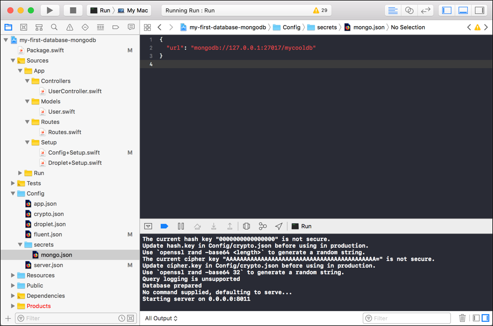

  <h2>My First Database (MongoDB) 👨🏼‍💻 </h2>
  <h3>Tutorial to build this project</h3>
  <h4><a href="https://medium.com/@martinlasek/tutorial-how-to-use-mongodb-e45b0f45fe64">How to use MongoDB</a></h4>
   
  

## Community 🚀
Join the awesome and welcoming Vapor community in <a href="http://vapor.team/"><b>Slack!</b></a>
